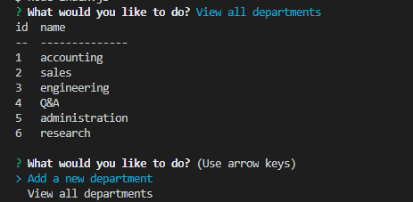
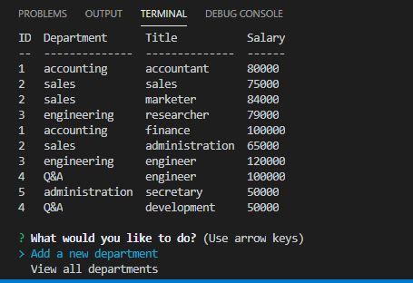
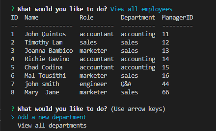

# Employee-Tracker

This application displays information regarding employees. You can add/view a new department, role, or employee as well as update existing employee information. All of the data entered is stored in a database and is handled with SQL. Everything is done in the command line, so you will be able to manipulate the employee data by answering prompts as well as view it.

## Challenges faced

This application required the use of new concepts that were very challenging. This was the first application where I used MySQL to store my data. This required me to properly store and join my data in tables as well as use the correct queries to retrieve the tables I needed. The use of the commandline meant I had to use several node modules including inquirer for the user prompts. Figuring out how to get values from user inputs to send as a query to MySQL was one of the biggest challenges I faced.

## How it looks

